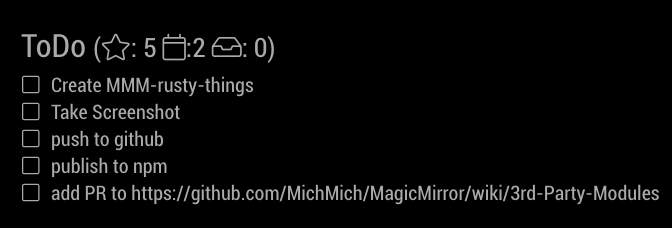

# MMM-rusty-things

MagicMirror module to access your todo-entries from Things and display them in MM.
It was a learning project for me where I learnt about how to interact between Rust and Node.

# Screenshot

The module looks like this:


# TODO

- Publish version of neon-serde2 that works (hacked together)
- 




# Compiling

```
git clone https://github.com/piceaTech/MMM-rusty-things.git
cd MMM-rusty-things.git
npm install
mv example.env .env
```
Edit the `.env` and insert your hist_id. 

After that either compile the native module locally on the pi or cross-compile from your desktop.

## Cross-compilation (e.g. from x64 to arm)
1. Build the build-Container
  1. `git clone https://github.com/piceaTech/rust-on-raspberry-docker`
  1. `cd rust-on-raspberry-docker`
  1. `git checkout neon`
  1. If you need another node version than the current LTS-Version: Edit the Dockerfile and switch to correct BaseImage.
  1. `docker build --tag "neon-pi-cross:latest" .`
1. Copy the following dependencies as `.deb`s into `native/pi_deps`
  1. ssl: http://ftp.debian.org/debian/pool/main/o/openssl1.0/libssl1.0-dev_1.0.2r-1~deb9u1_armhf.deb
  1. sqlite: http://ftp.debian.org/debian/pool/main/s/sqlite3/libsqlite3-dev_3.16.2-5+deb9u1_armhf.deb
1. Inside your neon-folder run `native/build.sh`. This should create a `native/index.node` which should be compatible with arm.
1. Deploy this artifact to the pi!
1. Done


This project was bootstrapped by [create-neon](https://www.npmjs.com/package/create-neon).

## Installing rusty-things

Installing rusty-things requires a [supported version of Node and Rust](https://github.com/neon-bindings/neon#platform-support).

You can install the project with npm. In the project directory, run:

```sh
$ npm install
```

This fully installs the project, including installing any dependencies and running the build.

## Building rusty-things

If you have already installed the project and only want to run the build, run:

```sh
$ npm run build
```

This command uses the [cargo-cp-artifact](https://github.com/neon-bindings/cargo-cp-artifact) utility to run the Rust build and copy the built library into `./index.node`.

## Available Scripts

In the project directory, you can run:

### `npm install`

Installs the project, including running `npm run build`.

### `npm build`

Builds the Node addon (`index.node`) from source.

Additional [`cargo build`](https://doc.rust-lang.org/cargo/commands/cargo-build.html) arguments may be passed to `npm build` and `npm build-*` commands. For example, to enable a [cargo feature](https://doc.rust-lang.org/cargo/reference/features.html):

```
npm run build -- --feature=beetle
```

#### `npm build-debug`

Alias for `npm build`.

#### `npm build-release`

Same as [`npm build`](#npm-build) but, builds the module with the [`release`](https://doc.rust-lang.org/cargo/reference/profiles.html#release) profile. Release builds will compile slower, but run faster.

### `npm test`

Runs the unit tests by calling `cargo test`. You can learn more about [adding tests to your Rust code](https://doc.rust-lang.org/book/ch11-01-writing-tests.html) from the [Rust book](https://doc.rust-lang.org/book/).

## Project Layout

The directory structure of this project is:

```
rusty-things/
├── Cargo.toml
├── README.md
├── index.node
├── package.json
├── src/
|   └── lib.rs
└── target/
```

### Cargo.toml

The Cargo [manifest file](https://doc.rust-lang.org/cargo/reference/manifest.html), which informs the `cargo` command.

### README.md

This file.

### index.node

The Node addon—i.e., a binary Node module—generated by building the project. This is the main module for this package, as dictated by the `"main"` key in `package.json`.

Under the hood, a [Node addon](https://nodejs.org/api/addons.html) is a [dynamically-linked shared object](https://en.wikipedia.org/wiki/Library_(computing)#Shared_libraries). The `"build"` script produces this file by copying it from within the `target/` directory, which is where the Rust build produces the shared object.

### package.json

The npm [manifest file](https://docs.npmjs.com/cli/v7/configuring-npm/package-json), which informs the `npm` command.

### src/

The directory tree containing the Rust source code for the project.

### src/lib.rs

The Rust library's main module.

### target/

Binary artifacts generated by the Rust build.

## Learn More

To learn more about Neon, see the [Neon documentation](https://neon-bindings.com).

To learn more about Rust, see the [Rust documentation](https://www.rust-lang.org).

To learn more about Node, see the [Node documentation](https://nodejs.org).
